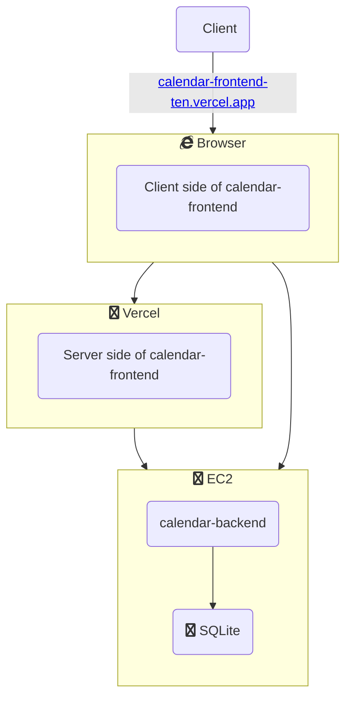

# Architecture overview

Currently, the *calendar* project has 3 components:
- [calendar-frontend](./calendar-frontend.md): the frontend written using Next.js
- [calendar-backend](./calendar-backend.md): the backend written in Rust
- `calendar-docs`: this book

