# Deploy `calendar-backend` to EC2

Currently, the `calendar-backend` is deployed to EC2.

This guide will describe how to deploy on a new EC2 machine and how to configure the deployment pipeline.

1. First we need to launch a new EC2 instance
   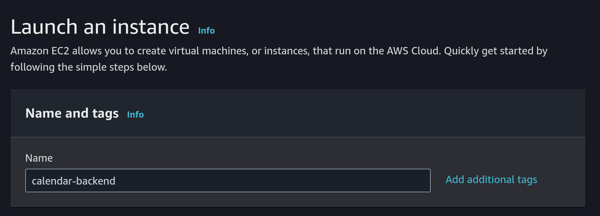
    1. Choose `Amazon Linux` as OS and a 64 bit architecture
       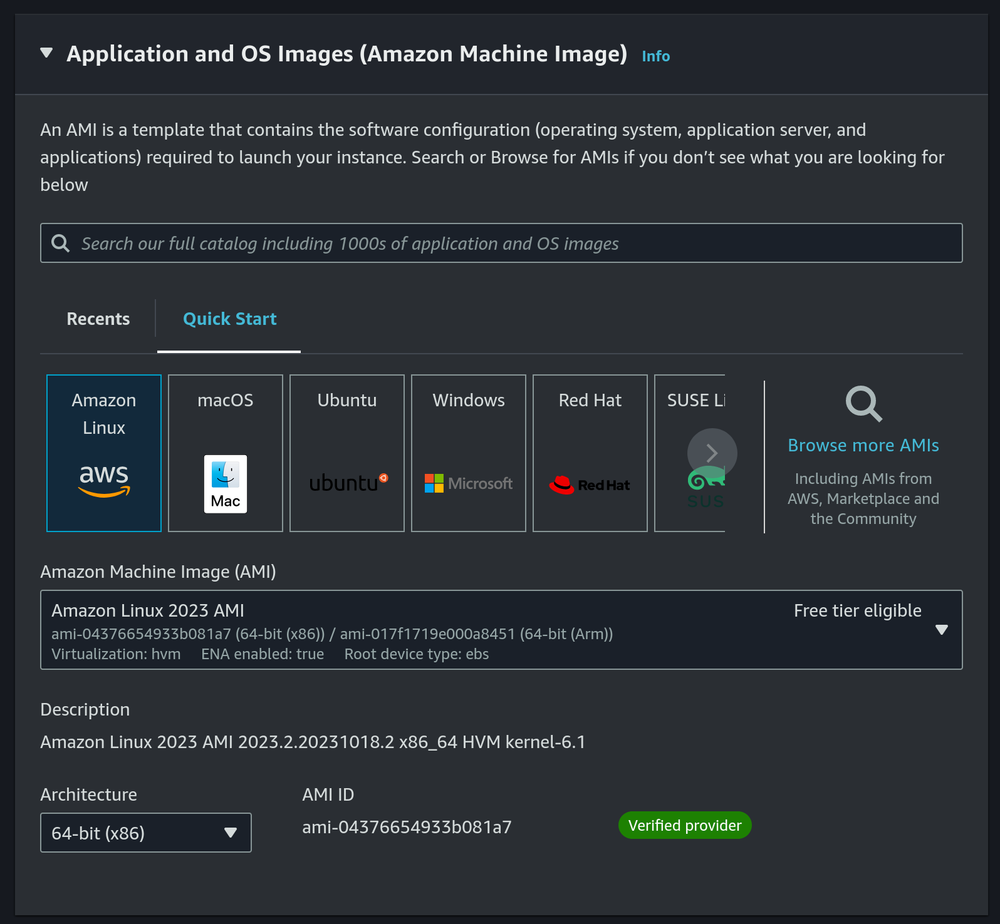
    2. Instance type: `t2.nano`
       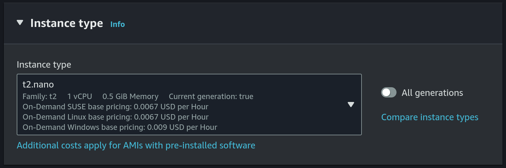
       This is the cheapest and smallest instance type.
    3. Choose `calendar-backend` as the key pair
       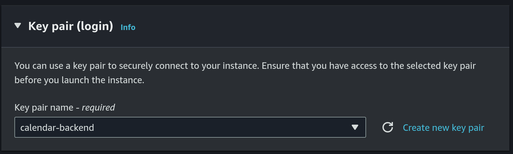
       Or we can create a new key pair, just make sure to update the github secret (details will follow in a step below).
    4. Use `calendar-backend` security group
       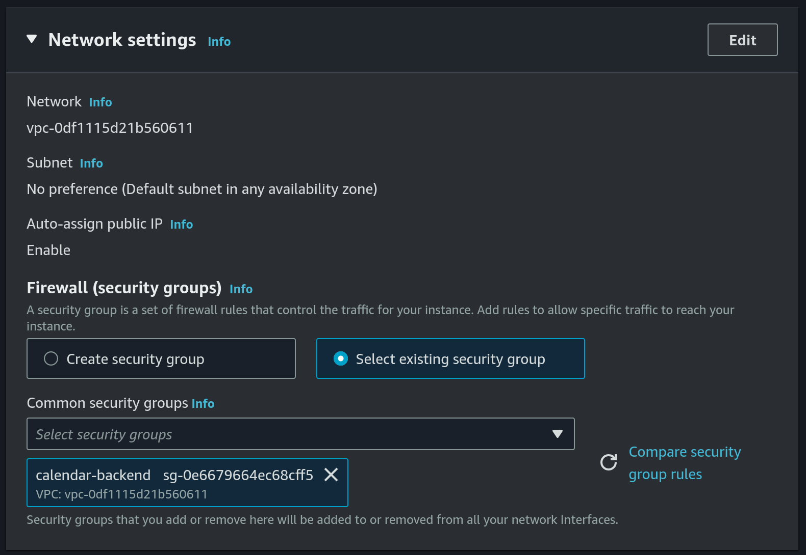
       Or we can create a new security group, we will need the following ports to be added under the inbound rules:
       - `22` - `SSH` port used by [our github-actions](https://github.com/calendar-team/calendar-backend/blob/master/.github/workflows/deploy_on_ec2.yml) workflow to deploy new version of `calendar-backend`
       - `80` - used by certbot to renew the TLS certificate (details will follow in a step below)
       - `8080` - this is the port that `calendar-backend` uses
    5. Allocate a 30 GB gp3 disk
       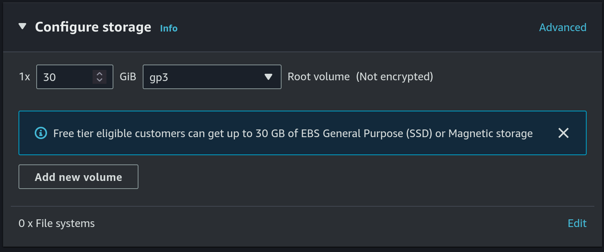
    6. Create S3 bucket for DB backup
       - Set `calendar-db-backup` as the name and use `eu-central-1` as the region:
         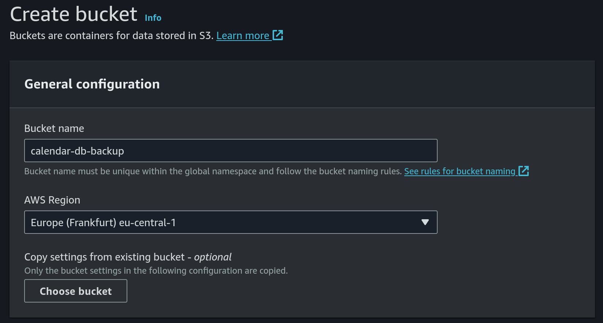
       - Keep `ACLs disabled` as object ownership option:
         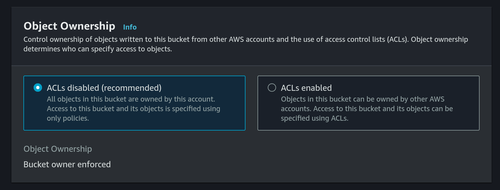
       - Block public access:
         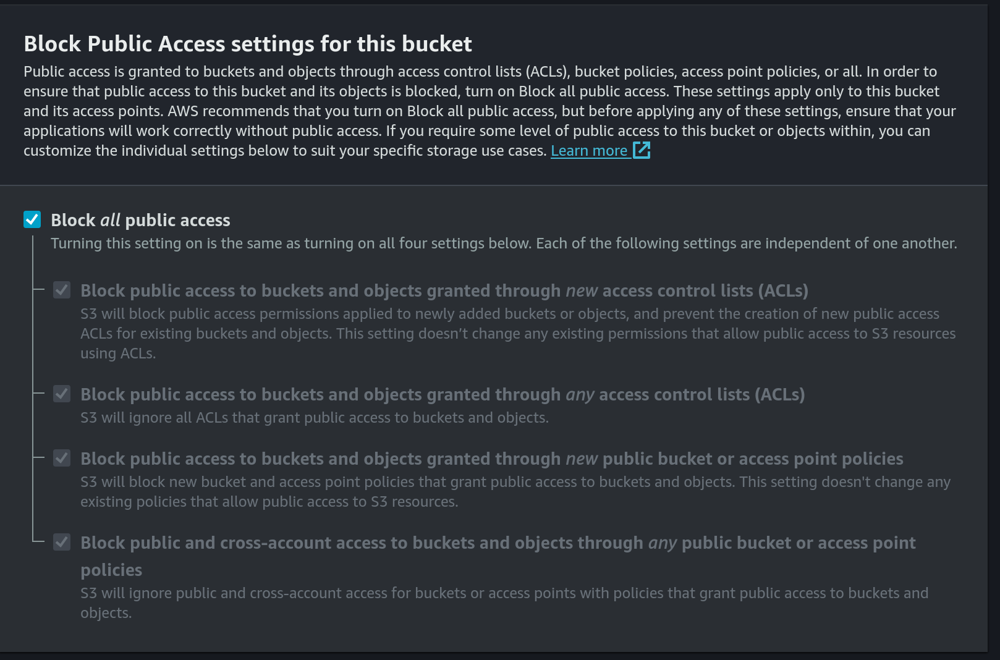
       - Enable versioning:
         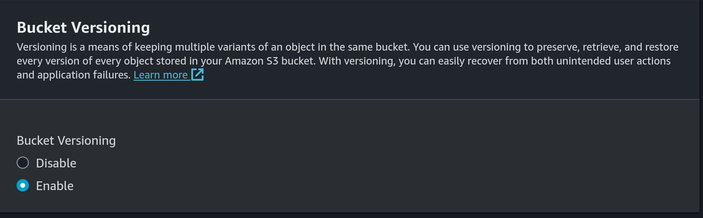
       - Use default encryption:
         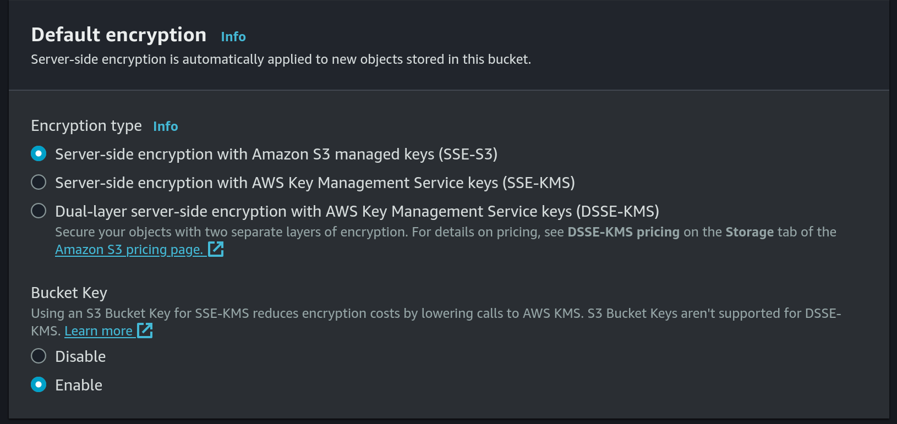
    7. Create a new IAM Policy for S3 put access:
       - Choose `S3` as the service and `PutObject` as access level:
         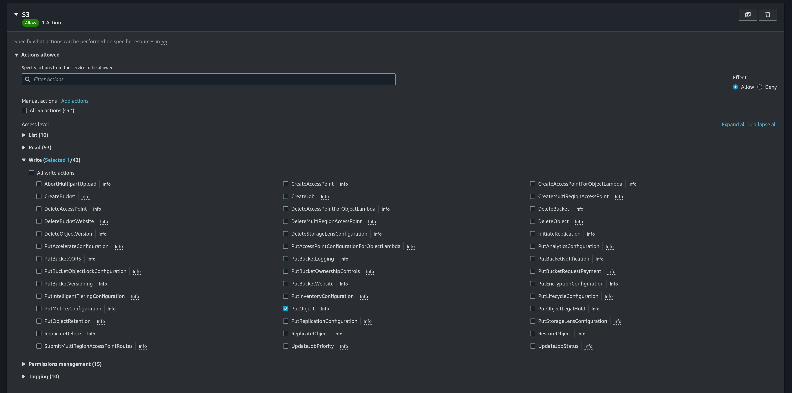
       - Add a new ARN for `calendar-db-backup` bucket and `database.db3` file:
         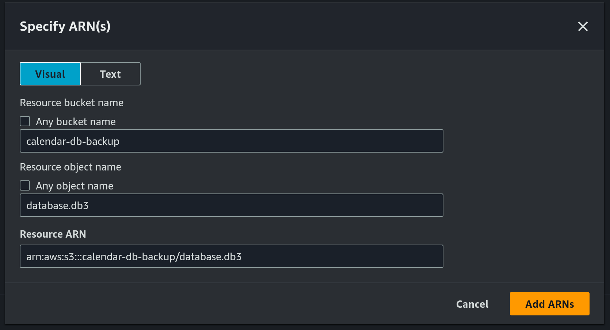
       - Use `calendar_db_backup` as the pollicy name:
         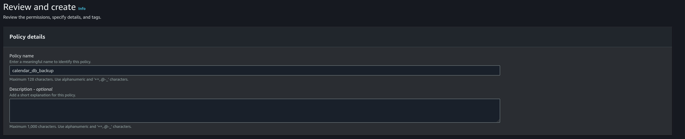
    8. Create a new IAM role
       - Choose `AWS service` as the trusted entity type:
         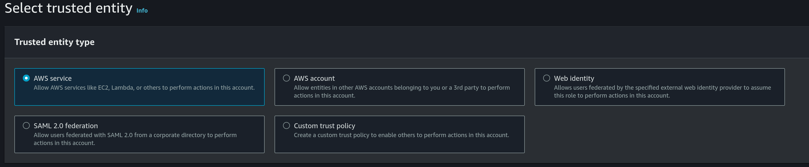
       - Use `EC2` as the use case:
         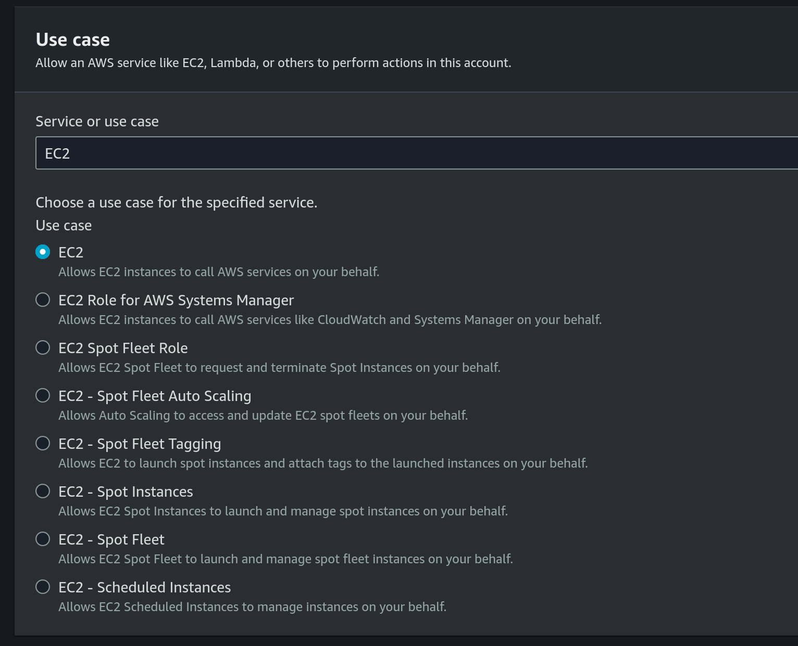
       - Choose the previously created IAM Policy under permissions policies:
         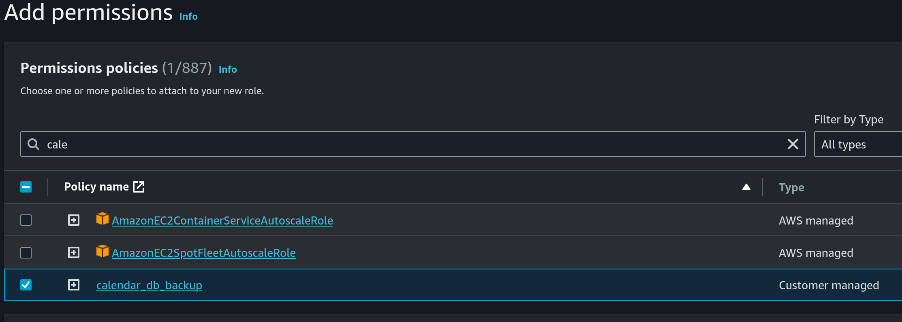
       - Use `calendar_db_backup` as the name:
         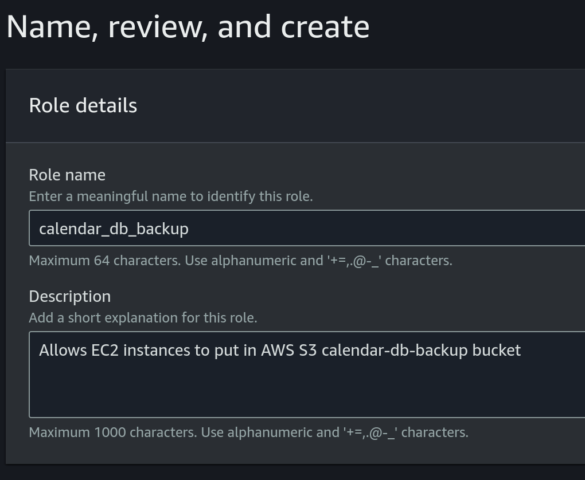
    9. Attach role to EC2 instance:
       - Choose the EC2 instance, then click on `Actions`, then click on `Modify IAM role` under `Security`
         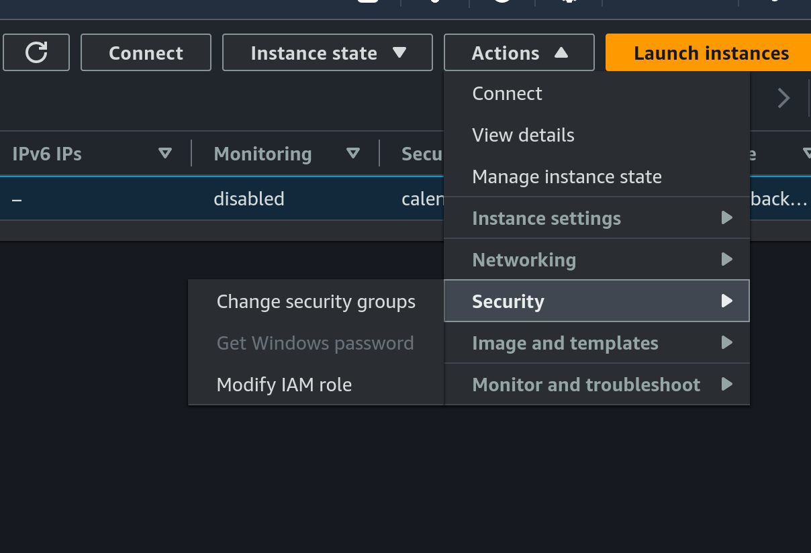
       - Choose the previously created IAM role:
         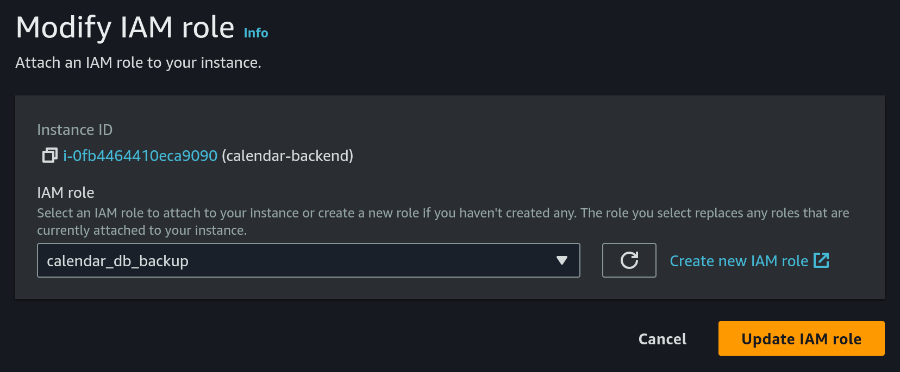
    10. Configure cron on EC2
         - SSH into the EC2 machine
         - Install `crond` becaues it's not present by default:
            - install `cronie`
               ```
               sudo dnf install cronie
               ```
            - enable `crond`
               ```
               sudo systemctl enable crond
               ```
            - check that `crond` is running as expected
               ```
               sudo systemctl status crond
               ```
               The result should look like:
               ```
               ● crond.service - Command Scheduler
               Loaded: loaded (/usr/lib/systemd/system/crond.service; enabled; preset: enabled)
               Active: active (running) since Tue 2024-04-16 06:59:54 UTC; 4min 57s ago
               Main PID: 1858743 (crond)
               Tasks: 2 (limit: 510)
               ...
               ```
         - install sqlite
            ```
            sudo yum install sqlite-devel
            ```
         - create a new file `db_backup.sh` in home directory (`/home/ec2-user`):
            ```
            cd /home/ec2-user
            sqlite3 database.db3 ".backup 'database_backup.db3'"
            aws s3 cp database.db3 s3://calendar-db-backup/database.db3
            rm database_backup.db3
            ```
         - give exec permissions to the previous file:
            ```
            chmod +x db_backup.sh
            ```
         - run:
            ```
            echo "0 0,6,12,18 * * * root /home/ec2-user/db_backup.sh" | sudo tee -a /etc/crontab > /dev/null
            ```
            This will upload the database to S3 bucket every day at 00:00, 06:00, 12:00, 18:00 UTC time
2. Configure the TLS certificate by following the tutorial from [here](https://certbot.eff.org/instructions?ws=other&os=pip). 
   
   Note that you will have to `ssh` into the EC2 machine for setting the certificate. To do this we will need:
   - the private key from the key pair that we chose on instance creation from above
   - the public DNS of our EC2 instance. This can be found in AWS console on instance details
   - run the following command from a terminal:
     ```
     ssh -i PATH_TO_SSH_KEY ec2-user@EC2_PUBLIC_DNS
     ```

   Also make sure that the `calendar-backend` is [pointing](https://github.com/calendar-team/calendar-backend/blob/master/src/lib.rs#L308-L313) to the correct certificate.
3. Configure the deployment pipeline. For this we will have to update a few github secrets:
   - [SSH_PRIVATE_KEY](https://github.com/calendar-team/calendar-backend/settings/secrets/actions/SSH_PRIVATE_KEY) - this should be the private key of the key pair configured on EC2 from above
   - [REMOTE_HOST](https://github.com/calendar-team/calendar-backend/settings/secrets/actions/REMOTE_HOST) - this should be the public DNS of our EC2 instance
   - [REMOTE_USER](https://github.com/calendar-team/calendar-backend/settings/secrets/actions/REMOTE_USER) - set this to `ec2-user`
   - [CALENDAR_JWT_SIGNING_KEY](https://github.com/calendar-team/calendar-backend/settings/secrets/actions/CALENDAR_JWT_SIGNING_KEY) - the secret key used by the `calendar-backend` to sign jwt tokens
4. Finally we can trigger `Deploy to EC2` workflow to deploy `calendar-backend` to the newly created EC2 instance

You can find a sequence diagram explaining the process of deploying to EC2 [here](./decisions/0001-calendar-backend-ci-cd.md#github-actions-with-ssh-and-rsync).
