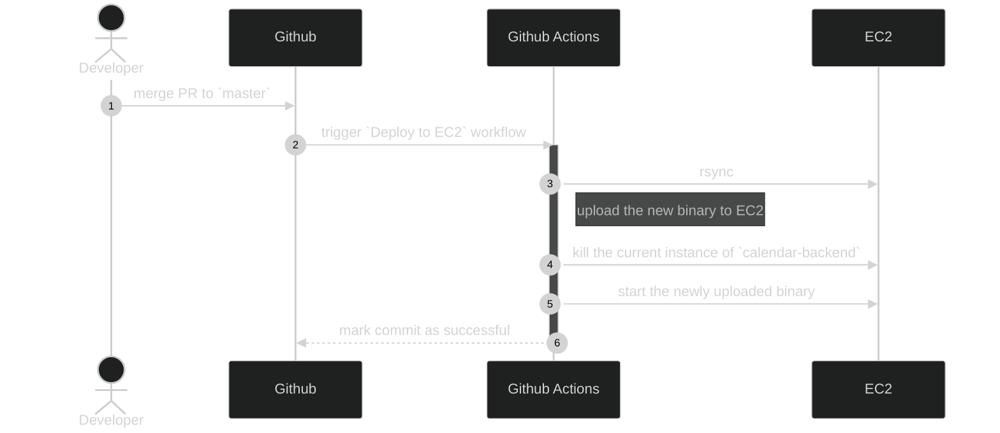

```
status: accepted
date: 2023-09-03
```
# calendar-backend CI/CD pipeline

## Context and Problem Statement

We want to fully automate the process of deployment of `calendar-backend`.

On every commit on `master` branch, a new version of the application should be deployed in production.

On every commit on any branch, the application is compiled and all the tests are executed. No merge is allowed if at least one test fails.

## Considered Options

* `Jenkins`
* `Github Actions` with `AWS CodeDeploy`
* `Github Actions` with `SSH` and `rsync`

## Decision Outcome

Chosen option: `Github Actions` with `SSH` and `rsync`

This option was chosen because it is the simplest one, so it allowed us to achieve a functional CI/CD pipeline faster.

### Confirmation
Implementation of the ADR was confirmed through a PR review in [#3](https://github.com/calendar-team/calendar-backend/pull/3)

## Pros and Cons of the Options

### Jenkins

Deploy a self-managed `Jenkins` instance, connect to Github, and react to events from Github.

On every commit on any branch, build the app, then run all the tests.

On commit on `master` branch, deploy the new version on `EC2`.

* Good, because this is the most configurable option. Jenkins allows to configure the Pipeline however we need
* Good, becauses there is no limit in number of builds, we can run as often as we need
* Bad, because we need to host the `Jenkins` instance somewhere, and this may imply additional costs
* Bad, because we need to maintain the instance up to date and healthy all the time, and this may imply additional effort in the future
* Bad, because it will slow us down, we need to configure and run the `Jenkins` instance before starting to configure the CI/CD pipeline itself

### `Github Actions` with `AWS CodeDeploy`

See the details in the article: [link](https://aws.amazon.com/blogs/devops/integrating-with-github-actions-ci-cd-pipeline-to-deploy-a-web-app-to-amazon-ec2/)


* Good, because we don't manage any services, Github Actions can be used out of the box
* Good, because it decouples from any particular `EC2` instance, so `EC2` instances can be killed at any moment without disruption
* Bad, because we need to configure additional `AWS` services, which makes us more coupled with `AWS`
* Bad, because we need to configure multiple `AWS` services, which will slow us down
* Bad, because we need to configure multiple `AWS` services, which may imply additional costs

### `Github Actions` with `SSH` and `rsync`

Explained through a sequence diagram:

The implementation can be found in the git repo: [link](https://github.com/calendar-team/calendar-backend/blob/master/.github/workflows/deploy_on_ec2.yml)
* Good, because we don't manage any services, Github Actions can be used out of the box
* Good, because we don't couple to `AWS` too much
* Good, because it is a simple solution which can be implemented fast
* Bad, because it is fragile, every time the `EC2` instance is restarted and changes the `IP` address, the CI/CD pipeline breaks, because we are connecting directly to the instance
